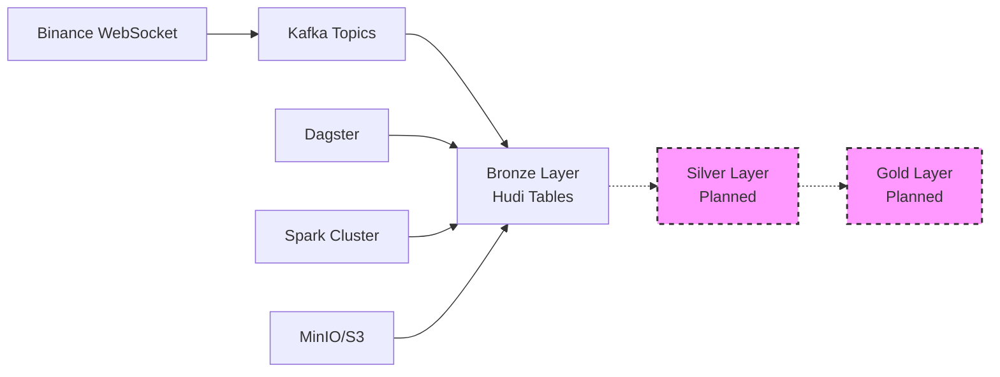

# 🚀 Crypto Data Pipeline

A real-time cryptocurrency data streaming pipeline that ingests live data from Binance WebSocket API through a medallion architecture foundation. Currently implements robust streaming infrastructure with bronze layer ingestion, with silver and gold layers planned for future development.

## 🏗️ Current Architecture



## 🎯 What's Currently Working

### ✅ Production-Ready Features
- **Real-time Streaming**: Live data ingestion from Binance WebSocket API
- **Bronze Layer**: Raw data ingestion with Kafka → Hudi pipeline
- **Centralized Configuration**: Symbol management through YAML configs
- **Data Quality**: Basic validation and quality scoring
- **Infrastructure**: Complete Docker-based deployment stack
- **Monitoring**: Basic service monitoring and health checks

### 📊 Current Data Flow
1. **Binance WebSocket** → Streams live market data (trades, tickers, klines, depth)
2. **Kafka Producer** → Routes messages to symbol-specific topics
3. **Bronze Assets** → Ingests trade data into Hudi tables with partitioning
4. **Dagster Orchestration** → Manages data pipeline workflows

## 🚀 Quick Start

### Prerequisites
- Docker & Docker Compose
- 8GB+ RAM recommended
- 10GB+ free disk space

### 1. Clone and Setup
```bash
git clone <your-repo-url>
cd crypto-data-pipeline
chmod +x *.sh
```

### 2. Configure Symbols
Edit `config/symbols.yaml` to customize trading pairs:

```yaml
symbols:
  tier1:
    - symbol: "BTCUSDT"
      name: "Bitcoin"
      priority: 1
      enabled: true
      streams: ["trade", "ticker", "kline_1m", "depth5"]
```

### 3. Deploy Pipeline
```bash
./deploy.sh
```

This will:
- ✅ Build Docker images
- ✅ Start infrastructure (Kafka, MinIO, Spark, PostgreSQL)
- ✅ Launch Dagster orchestration
- ✅ Begin streaming Binance data
- ✅ Create bronze layer Hudi tables

### 4. Access Services
- **Dagster UI**: http://localhost:3000 (Pipeline orchestration)
- **Spark UI**: http://localhost:8080 (Job monitoring)
- **MinIO Console**: http://localhost:9001 (Data storage)

### 5. Monitor Pipeline
```bash
./monitor.sh        # Basic service monitoring
docker-compose logs -f binance-consumer  # Streaming logs
```

## 📂 Project Structure

```
crypto-data-pipeline/
├── streaming/              # Real-time data ingestion
│   ├── service.py         # Main streaming orchestrator
│   ├── binance_websocket.py  # WebSocket client
│   └── kafka_producer.py  # Kafka message producer
├── crypto_pipeline/        # Dagster data pipeline
│   ├── assets/
│   │   ├── bronze_assets.py  # ✅ Implemented (trade data)
│   │   ├── silver_assets.py  # 🚧 Planned (OHLCV + indicators)
│   │   └── gold_assets.py    # 🚧 Planned (analytics)
│   ├── utils/
│   │   └── spark_utils.py    # Spark session management
│   └── definitions.py        # Dagster definitions
├── shared/                 # Shared utilities
│   ├── settings.py        # Configuration management
│   └── symbol_manager.py  # Symbol configuration
├── config/                # Configuration files
│   ├── symbols.yaml       # Symbol definitions
│   └── dagster.yaml       # Dagster configuration
└── docker-compose.yml     # Complete infrastructure
```

## 🔧 Configuration

### Symbol Management
All symbols are configured in `config/symbols.yaml`:

```yaml
symbols:
  tier1:
    - symbol: "BTCUSDT"
      name: "Bitcoin"
      priority: 1
      enabled: true
      streams: ["trade", "ticker", "kline_1m", "depth5"]
    - symbol: "ETHUSDT"
      name: "Ethereum"
      priority: 1
      enabled: true
      streams: ["trade", "ticker", "kline_1m", "depth5"]
  tier2:
    - symbol: "ADAUSDT"
      name: "Cardano"
      priority: 2
      enabled: false
```

### Environment Configuration
```bash
# Override active symbols
export ACTIVE_SYMBOLS="BTCUSDT,ETHUSDT"

# Configure environment
export ENVIRONMENT="development"
```

## 🔍 Current Capabilities

### Bronze Layer (Implemented)
- **Trade Data Ingestion**: Real-time trade data from Binance
- **Data Partitioning**: By symbol and date for optimal querying
- **Quality Scoring**: Basic validation and quality metrics
- **Hudi Integration**: ACID transactions and incremental processing

### Infrastructure (Implemented)
- **Kafka**: Message streaming with proper topic management
- **Spark**: Distributed processing with Hudi support
- **MinIO**: S3-compatible object storage
- **PostgreSQL**: Dagster metadata storage
- **Docker**: Complete containerized deployment

### Monitoring (Basic)
- **Health Checks**: Service availability monitoring
- **Logging**: Structured logging across all services
- **Metrics**: Basic throughput and error tracking

## 🚧 Development Roadmap

### Phase 1: Core Data Processing (In Progress)
- [ ] **Silver Layer Implementation**
  - [ ] OHLCV data aggregation (1m, 5m, 15m, 1h, 4h, 1d)
  - [ ] Technical indicators (SMA, EMA, RSI, MACD, Bollinger Bands)
  - [ ] Data quality filtering and validation
  - [ ] Multi-timeframe processing

- [ ] **Enhanced Bronze Layer**
  - [ ] Additional stream types (ticker, kline, depth)
  - [ ] Improved data quality scoring
  - [ ] Better error handling and recovery

### Phase 2: Analytics Foundation (Planned)
- [ ] **Gold Layer Implementation**
  - [ ] Portfolio performance metrics
  - [ ] Market correlation analysis
  - [ ] Trading signal generation
  - [ ] Risk metrics calculation

- [ ] **Advanced Monitoring**
  - [ ] Real-time dashboards
  - [ ] Data quality reports
  - [ ] Performance metrics
  - [ ] Alerting system

### Phase 3: Production Features (Future)
- [ ] **Cloud Integration**
  - [ ] AWS S3/GCS support
  - [ ] BigQuery integration
  - [ ] Scalable deployment options

- [ ] **Advanced Analytics**
  - [ ] Machine learning models
  - [ ] Predictive analytics
  - [ ] Anomaly detection
  - [ ] Real-time alerts

## 🛠️ Development

### Adding New Symbols
1. Update `config/symbols.yaml`
2. Restart streaming service: `docker-compose restart binance-consumer`
3. No code changes required!

### Extending the Pipeline
1. **Bronze Layer**: Add new stream types in `bronze_assets.py`
2. **Silver Layer**: Implement processing logic in `silver_assets.py`
3. **Gold Layer**: Add analytics in `gold_assets.py`

### Running Tests
```bash
./test.sh  # Run test suite (basic implementation)
```

## 🔧 Troubleshooting

### Common Issues

#### Consumer Not Receiving Data
```bash
# Check Kafka connectivity
docker-compose exec kafka kafka-console-consumer \
  --bootstrap-server localhost:9092 \
  --topic crypto_raw_btcusdt --from-beginning

# Check streaming logs
docker-compose logs -f binance-consumer
```

#### Spark Jobs Failing
```bash
# Check Spark logs
docker-compose logs spark-master
docker-compose logs spark-worker-1

# Verify Spark UI
curl http://localhost:8080
```

#### Storage Issues
```bash
# Check MinIO health
docker-compose exec minio mc admin info myminio

# List stored data
docker-compose exec minio mc ls myminio/datalake/ --recursive
```

## 📊 Performance & Scaling

### Current Performance
- **Streaming**: Handles ~100 messages/second per symbol
- **Storage**: Efficient partitioning by symbol and date
- **Processing**: Single-node Spark cluster (scalable)

### Scaling Options
```bash
# Scale Spark workers
docker-compose up -d --scale spark-worker-1=3

# Add more symbols
# Edit config/symbols.yaml and restart consumer
```

## 🤝 Contributing

### Development Setup
```bash
git clone <repo-url>
cd crypto-data-pipeline
./deploy.sh
```

### Code Style
- Python: Follow PEP 8 conventions
- Configuration: YAML with 2-space indentation
- Documentation: Clear comments and docstrings

### Contributing Guidelines
1. Fork the repository
2. Create feature branch
3. Implement changes with tests
4. Submit pull request

## 📚 Tech Stack

### Core Components
- **Apache Spark**: Distributed data processing
- **Dagster**: Data orchestration and monitoring
- **Apache Kafka**: Real-time message streaming
- **Apache Hudi**: Data lake with ACID transactions
- **MinIO**: S3-compatible object storage
- **PostgreSQL**: Metadata storage

### Infrastructure
- **Docker**: Containerization
- **Docker Compose**: Local orchestration
- **Python**: Primary programming language

## 🆘 Support

### Getting Help
- 📖 Check documentation and logs
- 🐛 Create GitHub issues for bugs
- 💡 Submit feature requests

### Current Limitations
- Silver and Gold layers are not yet implemented
- Limited to trade data processing only
- Basic monitoring capabilities
- Single-node deployment only

## 📄 License

This project is licensed under the MIT License - see the [LICENSE](LICENSE) file for details.

## 🙏 Acknowledgments

- [Binance](https://binance.com) for providing WebSocket APIs
- [Apache Spark](https://spark.apache.org/) community
- [Dagster](https://dagster.io/) team
- Open source data engineering community

---

## 🚀 Quick Commands

```bash
# Deployment
./deploy.sh                    # Start full pipeline
./stop.sh                     # Stop all services
./cleanup.sh                  # Clean environment

# Monitoring
./monitor.sh                  # Basic service status
docker-compose logs -f <service>  # View logs

# Management
docker-compose restart <service>  # Restart service
docker-compose ps            # Check service status
```

## 🎯 Current Status

✅ **Real-time Data Streaming** - Production ready  
✅ **Bronze Layer Ingestion** - Functional for trade data  
✅ **Infrastructure** - Complete Docker setup  
✅ **Configuration Management** - Flexible symbol configuration  
🚧 **Silver Layer Processing** - In development  
🚧 **Gold Layer Analytics** - Planned  
🚧 **Advanced Monitoring** - Basic implementation  

---

**Ready to stream crypto data in real-time? Start with `./deploy.sh`! 🚀**