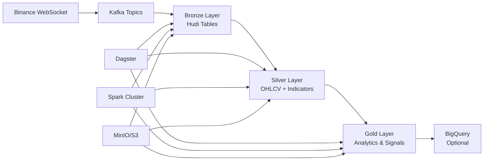

# 🚀 Crypto Data Pipeline

A comprehensive, production-ready cryptocurrency data pipeline that streams real-time data from Binance through a medallion architecture (Bronze → Silver → Gold) using modern data engineering tools.

## 🏗️ Architecture Overview


```mermaid
graph LR
    A[Binance WebSocket] --> B[Kafka Topics]
    B --> C[Bronze Layer<br/>Hudi Tables]
    C --> D[Silver Layer<br/>OHLCV + Indicators]
    D --> E[Gold Layer<br/>Analytics & Signals]
    E --> F[BigQuery<br/>Optional]
    
    G[Dagster] --> C
    G --> D
    G --> E
    H[Spark Cluster] --> C
    H --> D
    H --> E
    I[MinIO/S3] --> C
    I --> D
    I --> E
```

### 🎯 Key Features

- **Real-time Streaming**: Live data from Binance WebSocket API
- **Medallion Architecture**: Bronze (raw) → Silver (processed) → Gold (analytics)
- **Centralized Configuration**: Symbol management through YAML configs
- **Data Quality**: Built-in validation and quality scoring
- **Scalable Design**: From local development to cloud production
- **Future-Ready**: BigQuery integration prepared
- **Monitoring**: Comprehensive monitoring and alerting

## 📊 Data Layers

### Bronze Layer (Raw Data)
- **Purpose**: Ingest raw streaming data with minimal transformation
- **Data**: Trade ticks, 24h ticker stats, 1-minute klines, order book depth
- **Schema**: Individual trades, market data, timestamps, quality scores
- **Partitioning**: By symbol and date for optimal performance
- **Retention**: 30 days (configurable)

**Key Fields:**
- Symbol, stream type, event time
- Price, quantity, trade details
- Order book data (bids/asks)
- Data quality score and validation flags

### Silver Layer (Processed Data)
- **Purpose**: Clean, validated OHLCV data with technical indicators
- **Timeframes**: 1m, 5m, 15m, 1h, 4h, 1d
- **Features**: Data quality filtering, technical analysis
- **Retention**: 90 days (configurable)

**Technical Indicators:**
- Moving Averages (SMA, EMA)
- RSI, MACD, Bollinger Bands
- ATR, Volume metrics
- Price volatility and trends

### Gold Layer (Analytics)
- **Purpose**: Business metrics and trading insights
- **Content**: Portfolio analytics, market summaries, trading signals
- **Retention**: 365 days (configurable)

**Analytics:**
- Portfolio performance metrics
- Market correlation analysis
- Trading signal generation
- Risk metrics (Sharpe ratio, volatility)

## 🚀 Quick Start

### Prerequisites
- Docker & Docker Compose
- 8GB+ RAM recommended
- 20GB+ free disk space

### 1. Clone and Setup
```bash
git clone <your-repo-url>
cd crypto-data-pipeline

# Make scripts executable
chmod +x *.sh
```

### 2. Configure Symbols
Edit `config/symbols.yaml` to customize trading pairs:

```yaml
symbols:
  primary:
    - BTCUSDT
    - ETHUSDT
    - YOUR_SYMBOLS_HERE
```

Or set environment variable:
```bash
export ACTIVE_SYMBOLS="BTCUSDT,ETHUSDT,ADAUSDT"
```

### 3. Deploy Pipeline
```bash
./deploy.sh
```

This will:
- ✅ Build all Docker images
- ✅ Start infrastructure (Kafka, MinIO, Spark)
- ✅ Launch Dagster orchestration
- ✅ Begin streaming Binance data
- ✅ Create Hudi tables automatically

### 4. Access Services
- **Dagster UI**: http://localhost:3000 (Pipeline orchestration)
- **Spark UI**: http://localhost:8080 (Job monitoring)
- **MinIO Console**: http://localhost:9001 (Data storage)
- **Kafka UI**: http://localhost:8082 (Stream monitoring)

### 5. Monitor Pipeline
```bash
./monitor.sh        # Real-time dashboard
./test.sh           # Health checks
```

## 📝 Configuration Management

### Centralized Symbol Management

All symbols are managed in `config/symbols.yaml`:

```yaml
symbols:
  primary:
    - symbol: "BTCUSDT"
      name: "Bitcoin"
      priority: 1
      enabled: true
      streams: ["trade", "ticker", "kline_1m", "depth5"]
    - symbol: "ETHUSDT"
      name: "Ethereum" 
      priority: 1
      enabled: true
      streams: ["trade", "ticker", "kline_1m", "depth5"]
```

### Environment-Specific Configs

Support for development, staging, and production:

```yaml
# config/environments.yaml
environments:
  development:
    symbols:
      active: ["BTCUSDT", "ETHUSDT"]  # Limited for dev
  production:
    symbols:
      active: ["BTCUSDT", "ETHUSDT", "ADAUSDT", "DOTUSDT", "LINKUSDT"]
```

### Easy Symbol Addition

1. Add symbol to `config/symbols.yaml`
2. Restart consumer: `docker-compose restart binance-consumer`
3. No code changes required!

## 🔄 Data Processing Jobs

### Real-time Streaming
- **Bronze Ingestion**: Continuous WebSocket → Kafka → Hudi
- **Data Quality**: Real-time validation and scoring
- **Auto-partitioning**: By symbol and date

### Batch Processing
- **Bronze → Silver**: Every 6 hours
  - OHLCV aggregation for multiple timeframes
  - Technical indicator calculation
  - Data cleaning and validation

- **Silver → Gold**: Daily at 2 AM
  - Portfolio performance analytics
  - Market correlation analysis
  - Trading signal generation

### Orchestration
- **Dagster**: Workflow orchestration and monitoring
- **Sensors**: Automatic triggering on data arrival
- **Schedules**: Time-based job execution
- **Data Lineage**: Full pipeline traceability

## 📊 Monitoring & Operations

### Health Monitoring
```bash
# Real-time dashboard
./monitor.sh

# Quick status check
./monitor.sh status

# Generate report
./monitor.sh report
```

### Testing & Validation
```bash
# Comprehensive test suite
./test.sh

# Service health checks
# Kafka connectivity tests
# Data flow validation
# Performance benchmarks
```

### Data Quality
- Automated quality scoring (0.0 - 1.0)
- Validation flags for price, volume, timestamps
- Outlier detection and flagging
- Quality reports and recommendations

## 🚀 Scaling to Production

### 1. Cloud Storage Migration
Update configuration for S3/GCS:
```yaml
# config/environments.yaml
production:
  cloud:
    provider: "aws"
    region: "us-east-1"
    storage: "s3"
    bucket: "your-production-bucket"
```

### 2. Horizontal Scaling
```bash
# Scale Spark workers
docker-compose up -d --scale spark-worker-1=3

# Scale Kafka partitions for higher throughput
./deploy.sh --production
```

### 3. BigQuery Integration
```yaml
# config/bigquery.yaml
bigquery:
  project_id: "your-gcp-project"
  dataset: "crypto_analytics"
  sync:
    schedule: "0 */4 * * *"  # Every 4 hours
```

## 🛠️ Development

### Adding New Symbols
1. Update `config/symbols.yaml`:
```yaml
symbols:
  primary:
    - symbol: "SOLUSDT"
      name: "Solana"
      enabled: true
```

2. Restart consumer:
```bash
docker-compose restart binance-consumer
```

### Adding Technical Indicators
1. Edit `crypto_pipeline/utils/technical_indicators.py`
2. Add indicator calculation logic
3. Update silver asset processing

### Custom Analytics
1. Create new gold assets in `crypto_pipeline/assets/gold_assets.py`
2. Define business logic
3. Schedule in `crypto_pipeline/schedules/`

## 🔧 Troubleshooting

### Common Issues

#### 🔄 Consumer Not Receiving Data
```bash
# Check Kafka connectivity
docker-compose exec kafka kafka-console-consumer \
  --bootstrap-server localhost:9092 \
  --topic crypto_raw_btcusdt --from-beginning

# Check consumer logs
docker-compose logs -f binance-consumer

# Restart consumer
docker-compose restart binance-consumer
```

#### ⚡ Spark Jobs Failing
```bash
# Check Spark logs
docker-compose logs spark-master
docker-compose logs spark-worker-1

# Verify Spark UI
curl http://localhost:8080

# Check resource allocation
docker stats
```

#### 🗄️ MinIO Storage Issues
```bash
# Check MinIO health
docker-compose exec minio mc admin info myminio

# List buckets and data
docker-compose exec minio mc ls myminio/datalake/ --recursive

# Check storage usage
docker-compose exec minio mc du myminio/datalake/
```

#### 📊 Dagster Asset Failures
1. Check Dagster UI: http://localhost:3000
2. Review run logs in the web interface
3. Verify resource configurations
4. Check data quality scores

### Performance Optimization

#### Memory Issues
```bash
# Reduce Spark executor memory
export SPARK_WORKER_MEMORY=1G

# Limit active symbols for development
export ACTIVE_SYMBOLS="BTCUSDT,ETHUSDT"

# Restart with lower resources
./deploy.sh
```

#### Slow Processing
```bash
# Increase Spark parallelism
# Edit config/common.yaml:
spark:
  executor:
    instances: 3
    cores: 4

# Optimize Hudi table configurations
# Increase partition counts in Kafka
```

### Log Analysis
```bash
# Consumer logs
docker-compose logs binance-consumer | grep ERROR

# Dagster logs
docker-compose logs dagster-daemon | tail -100

# Spark application logs
docker-compose logs spark-master | grep -i error

# System resource usage
docker stats --no-stream
```

## 📈 Future Roadmap

### Phase 1: Enhanced Analytics (Q2 2024)
- [ ] Advanced technical indicators (Ichimoku, Williams %R)
- [ ] Market sentiment analysis from social media
- [ ] Cross-asset correlation heatmaps
- [ ] Automated portfolio optimization

### Phase 2: Real-time Features (Q3 2024)
- [ ] Real-time alerting system with email/Slack
- [ ] WebSocket API for live data streaming
- [ ] Real-time dashboards with Grafana
- [ ] Live trading signal notifications

### Phase 3: Machine Learning (Q4 2024)
- [ ] Price prediction models with TensorFlow
- [ ] Anomaly detection for market events
- [ ] Sentiment-based trading signals
- [ ] Automated strategy backtesting

### Phase 4: Multi-Exchange Support (Q1 2025)
- [ ] Coinbase Pro integration
- [ ] Kraken data streams
- [ ] Binance.US support
- [ ] Cross-exchange arbitrage detection

### Phase 5: Enterprise Features (Q2 2025)
- [ ] Multi-tenant architecture
- [ ] Role-based access control
- [ ] Advanced compliance reporting
- [ ] Professional trading tools integration

## 🛡️ Security & Compliance

### Data Security
- API keys stored in environment variables
- Network isolation with Docker networks
- Data encryption at rest in MinIO
- Secure inter-service communication

### Compliance Features
- Audit logging for all data operations
- Data lineage tracking through Dagster
- Configurable data retention policies
- Privacy controls for sensitive data

### Production Hardening
```bash
# Change default passwords
export MINIO_ROOT_PASSWORD="your-secure-password"
export DAGSTER_PG_PASSWORD="your-db-password"

# Enable SSL/TLS
# Configure firewall rules
# Set up monitoring alerts
```

## 🤝 Contributing

### Development Setup
```bash
# Clone repository
git clone <repo-url>
cd crypto-data-pipeline

# Setup development environment
./dev_setup.sh

# Run tests
./test.sh

# Code formatting
black crypto_pipeline/
flake8 crypto_pipeline/
```

### Adding Features
1. Fork the repository
2. Create feature branch: `git checkout -b feature/amazing-feature`
3. Make changes and add tests
4. Run test suite: `./test.sh`
5. Submit pull request

### Code Style
- Python: Black formatting, flake8 linting
- SQL: Consistent naming conventions
- YAML: 2-space indentation
- Documentation: Clear docstrings and comments

## 📚 Documentation

### Additional Resources
- [Architecture Deep Dive](docs/architecture.md)
- [Deployment Guide](docs/deployment.md)
- [Configuration Reference](docs/configuration.md)
- [API Documentation](docs/api_reference.md)
- [Troubleshooting Guide](docs/troubleshooting.md)

### Learning Resources
- [Apache Spark Documentation](https://spark.apache.org/docs/)
- [Dagster Documentation](https://docs.dagster.io)
- [Apache Hudi Documentation](https://hudi.apache.org/docs/)
- [Kafka Documentation](https://kafka.apache.org/documentation/)

## 🆘 Support

### Getting Help
- 📖 Check this README and documentation
- 🐛 Create GitHub issues for bugs
- 💡 Submit feature requests
- 💬 Join our Discord community (coming soon)

### Professional Support
For enterprise support, custom features, or consulting:
- Email: support@cryptopipeline.com
- Schedule consultation: [calendly.com/cryptopipeline](https://calendly.com/cryptopipeline)

## 📄 License

This project is licensed under the MIT License - see the [LICENSE](LICENSE) file for details.

## 🙏 Acknowledgments

### Built With
- [Apache Spark](https://spark.apache.org/) - Distributed data processing
- [Dagster](https://dagster.io/) - Data orchestration platform
- [Apache Kafka](https://kafka.apache.org/) - Stream processing
- [Apache Hudi](https://hudi.apache.org/) - Data lake framework
- [MinIO](https://min.io/) - Object storage
- [Docker](https://docker.com/) - Containerization

### Special Thanks
- Binance for providing excellent WebSocket APIs
- The open-source data engineering community
- Contributors and early adopters

---

## 🚀 Quick Commands Reference

```bash
# Deployment
./deploy.sh                    # Full deployment
./deploy.sh --skip-build      # Skip image building
./deploy.sh --help            # Show options

# Monitoring
./monitor.sh                  # Interactive dashboard
./monitor.sh status           # Quick status
./monitor.sh report           # Generate report

# Testing
./test.sh                     # Full test suite
./test.sh --help             # Show test options

# Management
./stop.sh                     # Graceful shutdown
./stop.sh --force            # Force stop
./cleanup.sh                 # Clean environment
./cleanup.sh --all           # Complete cleanup

# Development
./dev_setup.sh               # Development environment
docker-compose logs -f <service>  # View logs
docker-compose restart <service>  # Restart service
```

## 🎯 Key Benefits

✅ **Production Ready**: Battle-tested components and configurations  
✅ **Highly Configurable**: Centralized symbol and environment management  
✅ **Scalable Architecture**: From laptop to multi-cloud deployments  
✅ **Data Quality First**: Built-in validation and monitoring  
✅ **Developer Friendly**: Comprehensive tooling and documentation  
✅ **Future Proof**: Extensible design for new features and exchanges  
✅ **Open Source**: MIT licensed with active community support  

---

**Ready to build the future of crypto data analytics? Start with `./deploy.sh` and join the revolution! 🚀**